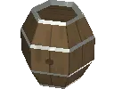

# BarrelBot

Meet BarrelBot, your personal assistant in your spiritual journey towards oneness with the Barrel.

> [!NOTE]
> Where to find BarrelBot ?\
> On the official Barrel Cult server (you need to be on [PlanetSmith](https://planetsmith.world/)'s server first)

> [!NOTE]
> Hey you ! Yes you :eyes: Looking for the Spam Rules and details ?\
> [Over here !](./cogs/README.md)

<h2>

Bot says hi !
</h2>
<strong> Made with </strong>

# Features

- Economy system
- Barrel spam moderation
- Daily  news
- Analytics about spam scores, palindromes, economy etc

# The lore™
BarrelBot was originaly created for the official Barrel cult server, with the aime to provide strict rules to the  spam taking place there, and add more fun activities to play with, the latest feature (still in the working) is the economy system.
The barrel cult server was created based on the original Barrel Cult over on Incandescent Games's Planetsmith discord server and it's community.
A cult was created revolving around the  that was the first mesh introduced into the game (and an emoji on the discord), multiple members have take part in spamming the  on the ps discord server, (25k+  counted from 0) which lead to the creation of a place where we could manage better activities around the  so we wouldn't disturb too much the PS discord.

# Contributing
To contribute to Bbot developement, simply write down your ideas; or fork this project and start working ! (we are not providing an easy way to setup your own bot, you need to do it on your own + there are hardcoded values in the code for some emojis, channels etc...) It is highly recommended that you contact the maintainer of the Bot aka the repo owner : Jan Kaje, to propose ideas and work them out !

Suggestions are always welcomed, there is a Gform but since we are already on github, open an issue with the `enhancement` tag and describe your ideas !

# Plans for the future
- [ WONT BE FOR A WHILE ] Probably redo parts of the bot to be able to run it on PS server to bring minigames focused on  there, we will have to get in touch with the admins to work things out etc...
- Continue the economy system (tech tree etc)
- get more  followers :sparkles:

